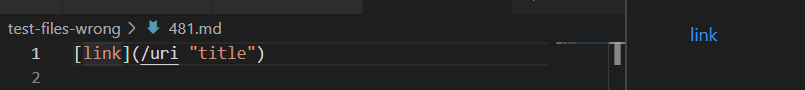
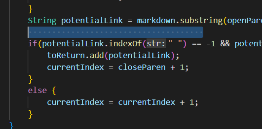
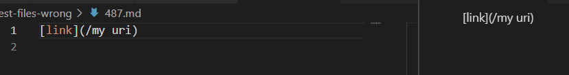
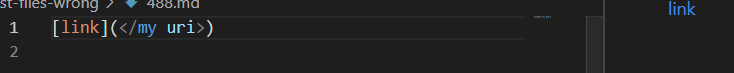
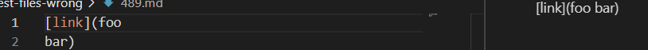
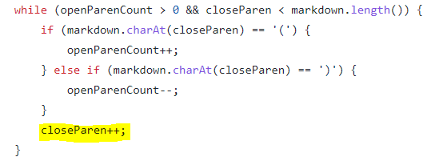
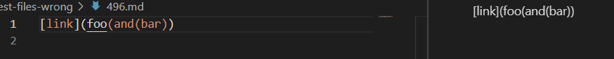
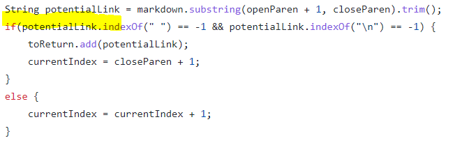
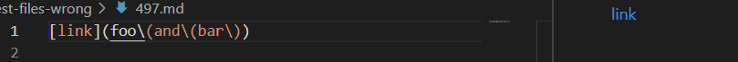
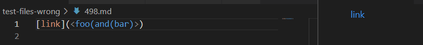

# Lab report 5 in week 10

in the lab 9, I comapred two results files from TA's markdownParse file and my own markdownParse file. 

[Test-files that generate different answer](test-files-wrong)

[My result files](myresults.txt)
[TA's result files](TAresults.txt)

To find differences, I use vimiff to compare two files. 

The code is :

`vimdiff my-markdown-parser/results.txt cse15lsp22-markdown-parser/results.txt`

The partial different results is listed below:

The numbers of files which generate different answer are listed below:

481.md 487.md 488.md 489.md 496.md 497.md 498.md 

For each files:

## 481.md：Viewed in VS Code preview window, it is :

The link inside is **title**  but both two files return wrong value:

one is /uri "title" and another is nothing at all.

Fix: to fix this, we might need to add a if sentence to check whether our final result contains"/" if it has, delete the "/" with following words until we meet space.

Here we could add

`if(potentialLink.contains("/")){`

   ` code trying to delete / with its following words;`

`}`

## for 487.md:

487, viewed in Preview Windows is:

it means that there is no link. So the method should print nothing. It have same problem in 481.md, so it could be fixed with 481

Here we could add

`if(potentialLink.contains("/")){`

   ` code trying to delete / with its following words;`

`}`

## 488.md

488, viewed in Preview Window is:

it should print "my url" but the first one add "<>" in both side and another one print nothing.

In this case, we might need to add a if sentence to check whether the potential link contains "<" and ">" if it has, store the content  between them. if no , continue to start

here we could add:

`if(potentialLink.contains("<") & potentialLink.contains(">")){
    store the content between "<" and ">" first and give potentialLink the newest string.
}`

## 489.md:

489, viewed in Preview Window is:

it means there should not be any content.

one still print foo bar in two lines and another print nothing.

here we should create a if to check that if we have already gone through the next line, the close paren should be invalid.

## 496.md:

496, viewed in Preview Window is:

it should not print anything but one print the foo(and(bar)

the problem here is the close paren and open paren inside is not equal

we should fix this by check the potentiallink have equal openParen and closeParen.

we add here to check whether the openParen and close Paren, we could some kind use the thought from get closest paren method, find add one if we encouter a open paren, minus one if we encouter a close paren. 

## 497.md:

497, viewed in Preview Window is: 

it means that there is no link. So the method should print nothing. It have same problem in 481.md, so it could be fixed with 481

Here we could add

`if(potentialLink.contains("/")){`

   ` code trying to delete / with its following words;`

`}`

## 498.md:
498, viewed in Preview Window is:

It has same problem as 488.md, so we could use same fix to fix this.

In this case, we might need to add a if sentence to check whether the potential link contains "<" and ">" if it has, store the content  between them. if no , continue to start

here we could add:

`if(potentialLink.contains("<") & potentialLink.contains(">")){
    store the content between "<" and ">" first and give potentialLink the newest string.
}`