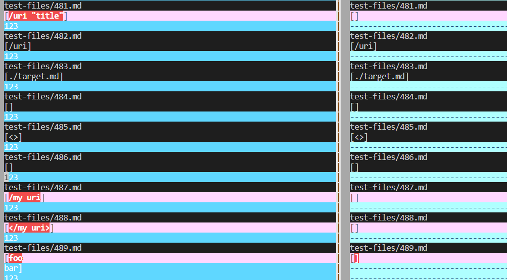
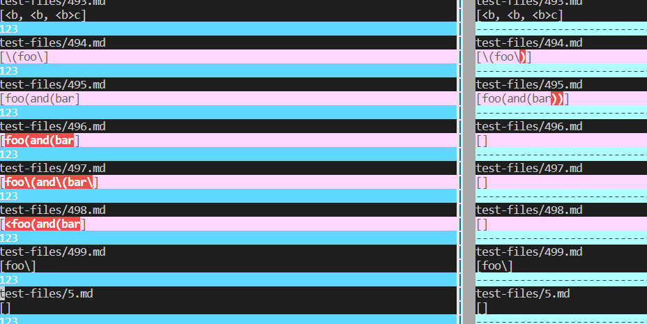

# Lab report 5 in week 10

in the lab 9, I comapred two results files from TA's markdownParse file and my own markdownParse file. 

[Test-files that generates different answer](test-files-wrong)

[My result files](myresults.txt)
[TA's result files](TAresults.txt)

To find differences, I use vimiff to compare two files. 

The code is :

`vimdiff my-markdown-parser/results.txt cse15lsp22-markdown-parser/results.txt`

The partial different results is listed below:

The numbers of files which generate different answer are listed below:

481.md 487.md 488.md 489.md 496.md 497.md 498.md 567.md

For each files:

481.md
