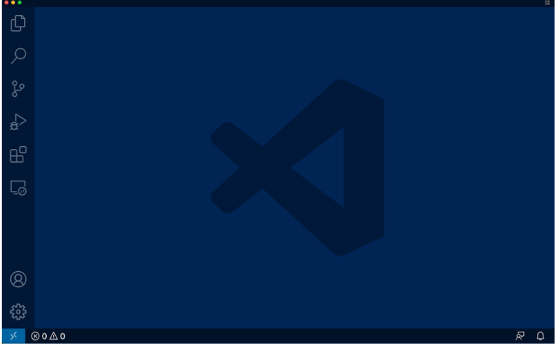
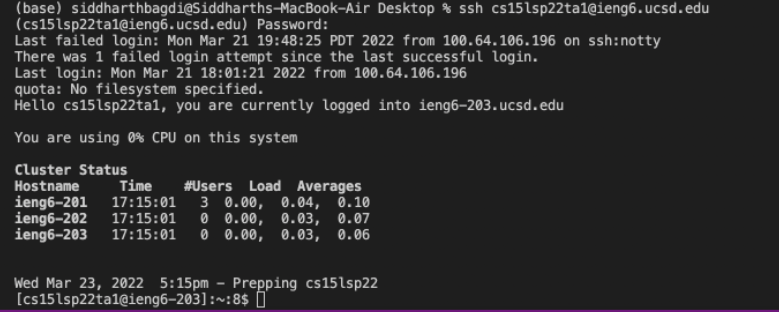
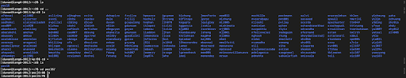
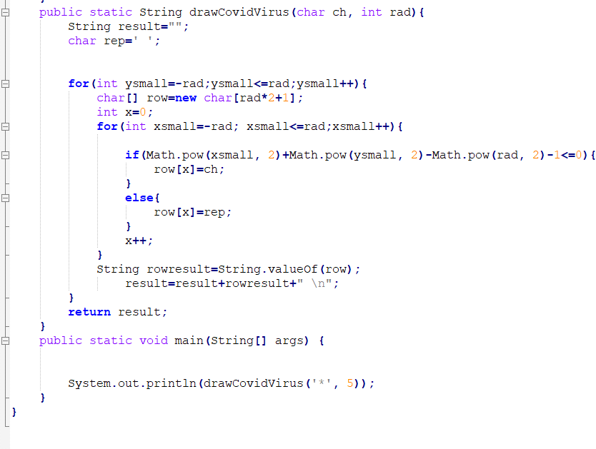
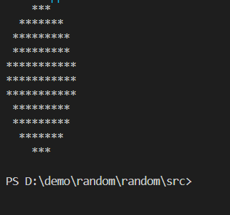

===
## The image is for the lab 2 test, not for the lab report.

# Lab Report(week 1 and 2, writing tutorial for the future students)

**Please wait for a few minutes to make sure that the system  updates this change**

## Download and Launch the VS Code
we use VS Code as CSE15L's IDE. You can download this through the link below or just simply google it!

[Download the VS Code](https://code.visualstudio.com/)

if you can successfully lauch the app and see the window below, it means that you install it well! 

## Remotely Connecting
OK, this is time when you should implement your username and password here

*important Reminder: please check whether your PC installs the SSH Client and SSH Server correctly.* You can click "Your PC", click "Features", there should be a list listing all the things you installed, if you cannot find "SSH Client" or "SSH Server", you can find them by click "optional feature", click download button and wait a few minutes.

**First, find the terminal window**
Open a terminal in VSCode (Ctrl + `, or use the Terminal → New Terminal menu option). then write the command

`ssh cs15lsp22<>@ieng6.ucsd.edu`

if it's your first time to log in your Account, you might say this message below.

`The authenticity of host 'ieng6.ucsd.edu (128.54.70.227)' can't be established.`
`RSA key fingerprint is SHA256:ksruYwhnYH+sySHnHAtLUHngrPEyZTDl/1x99wUQcec.`

`Are you sure you want to continue connecting (yes/no/[fingerprint])?`

Please write "yes " in the terminal window. It will be fine.

After that, the system will require you to input your password. 
If you do not see the password you input, that is totally fine because the terminal won't show the password.

If you can see the information below, it means that you successfully connect remotely to the server.

`Last login: Sun Jan  2 14:03:05 2022 from 107-217-10-235.lightspeed.sndgca.sbcglobal.net`
`quota: No filesystem specified.`
`Hello cs15lsp22<your unique string>, you are currently logged into ieng6-203.ucsd.edu`

`You are using 0% CPU on this system`

`Cluster Status` 
`Hostname     Time    #Users  Load  Averages  `
`ieng6-201   23:25:01   0  0.08,  0.17,  0.11`
`ieng6-202   23:25:01   1  0.09,  0.15,  0.11`
`ieng6-203   23:25:01   1  0.08,  0.15,  0.11`

`Sun Jan 02, 2022 11:28pm - Prepping cs15lsp22`

# Good job! Let's try some commands here

* ls
* cd
* ls <directory>
* cp /home/linux/ieng6/cs15lsp22/public/hello.txt ~/
* cat /home/linux/ieng6/cs15lsp22/public/hello.txt

If you input something wrong or just want to shuttle the connection down, **You can use Ctrl+D or exit in the terminal**

You could find some result pictures below.

ls-a command:

.png)

ls-lat command:
.png)

cd command:

# Good job! Now let's try how to transfer our local file to the remote server

* First , let us establish a new file in our local file. We assumed that you established the JAVA environment in VS Code, you can create a new java file and give some commands there, Everything are ok!

* Second, first run this in our local computer to make sure that our files can successfully compile and run.

* Finally, use the command in the next line 

`scp Yourname.java cs15lsp22<>@ieng6.ucsd.edu:~/`

It will require you input your password and once you did it, **You should log in your username and if you use 'ls' command, you will see that the file is successfully uploaded.**

.png)

## The difference between local run and server run.
Please creae a java file with following content below:

`class WhereAmI {`  
        `public static void main(String[] args) {`
             `System.out.println(System.getProperty("os.name"));`
            `System.out.println(System.getProperty("user.name"));`
            `System.out.println(System.getProperty("user.home"));`
            `System.out.println(System.getProperty("user.dir"));`
 
  `}`

`}`

**Run it both in the local computer and the server, you will the differences**

.png)

The reason for the different output is that the properties of local computer and server are quite different.

# Set your ssh keys

**Do you get tired of inputing your long password all the time?**  Using the following method could make your establish a passpharse for your own and get quick access when you log into your server.

On your loca computer, write the following command below

`ssh-keygen`

*Really important notice: if your computer has Windows System, you should write (ssh-keygen -t ed25519) instead of the command above, Also please make sure that in the following step, you address is correct, two commands here will create different name of the file.*

After that, you should see this below:

`Generating public/private rsa key pair.`

`Enter file in which to save the key (/Users/<user-name>/.ssh/id_rsa): /Users/<user-name>/.ssh/id_rsa`

`Enter passphrase (empty for no passphrase):`

Then you can input any simple passphrases, recommand to create a empty passphrase

Enter same passphrase again: 

Your identification has been saved in /Users/<user-name>/.ssh/id_rsa.

Your public key has been saved in /Users/<user-name>/.ssh/id_rsa.pub.

The key fingerprint is:
SHA256:jZaZH6fI8E2I1D35hnvGeBePQ4ELOf2Ge+G0XknoXp0 <user-name>@<system>.local

The key's randomart image is:

+---[RSA 3072]----+

|                 |

|       . . + .   |

|      . . B o .  |

|     . . B * +.. |

|      o S = *.B. |

|       = = O.*.*+|

|        + * *.BE+|

|           +.+.o |

|             ..  |

+----[SHA256]-----+

**After that if you want to log in or upload files, you can write your passpharse and save Lots of time!**

.png)

# Using SSH key, fasten your speed.

You can write a command in quotes at the end of an ssh command to directly run it on the remote server, then exit. For example, this command will log in and list the home directory on the remote server:

$ ssh cs15lsp22zz@ieng6.ucsd.edu "ls"

.png)

You can use semicolons to connect mutltiple commands, try the following codes, which could upload, compile and run one java file on the server.

$ cp WhereAmI.java OtherMain.java; javac OtherMain.java; java WhereAmI

