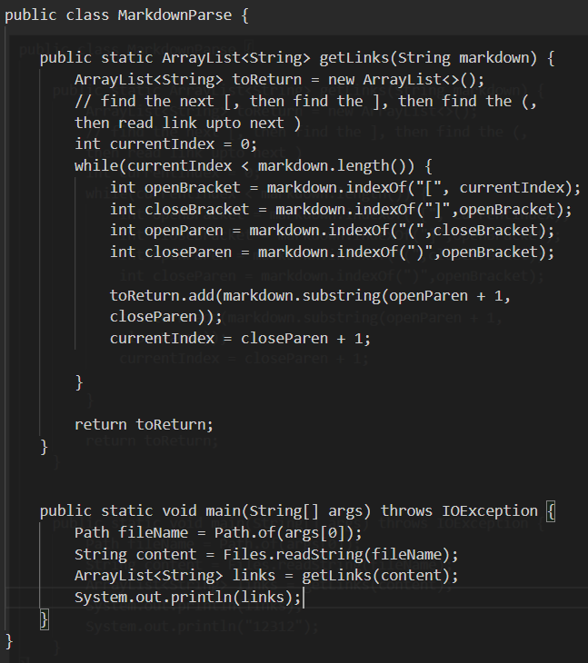
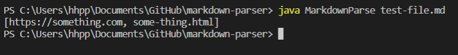
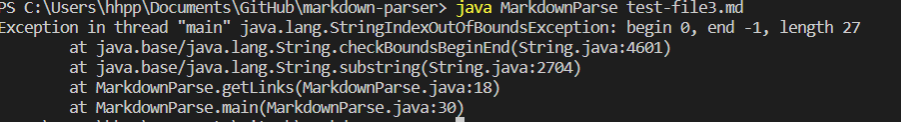
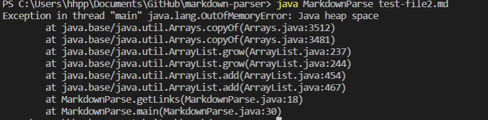
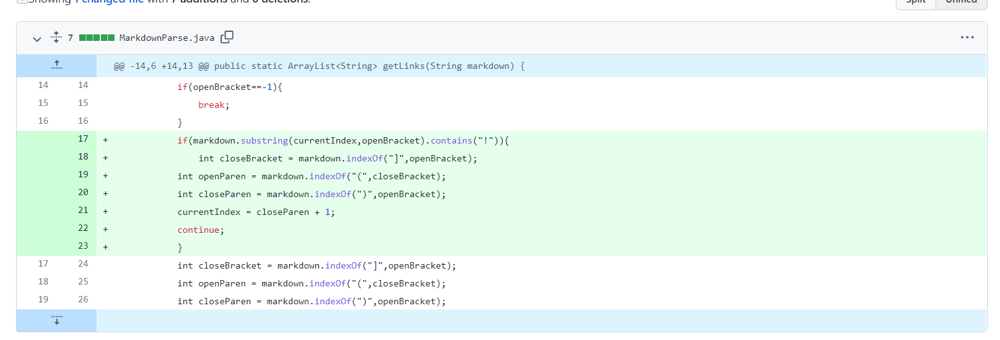
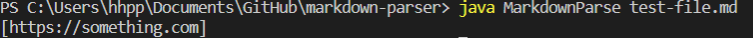
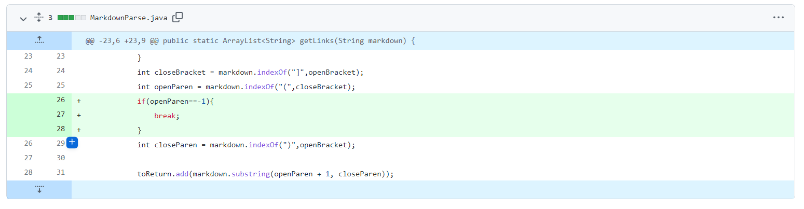
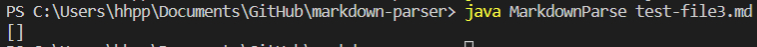
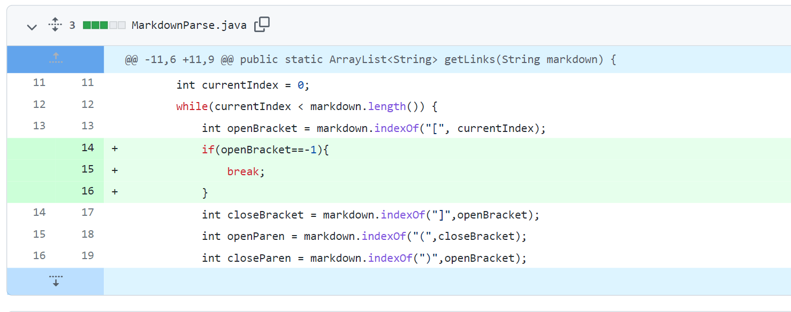
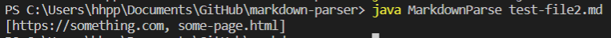

# Bad examples and Symtoms shown by extra examples

The original code and example lists below:
Code:

Example:

`# Title`

`[link1](https://something.com)`

`[link2](some-thing.html)`

**The initial example works well but there are another three examples that showing bad symtoms:**

* `# Title`

  `[link1](https://something.com)`

  ``

  In this case, the code will print image link too. because the link and image have similiar ways to show their content in Markdown file.

  [First example file](test-file9.md)

  **Symtoms:**
  

* `# Title`

   `[]`

   `more text here`

  In this case, the code cannot find "(" and ")", it will generate errors.

  [Second example file](test-file3.md)

  **Symtoms:**

  

* `# Title`

  `[a link!](https://something.com)`

  `[another link!](some-page.html)`

  `some paragraph text after the links`

  In this case, the code will run for a infinite loop because there is a blank line after the link.
  [Thrid example file](test-file2.md)

   **Symtoms:**

  

  # Changes to fix these bugs
  
  * fix Bug 1, the reason is the code cannot dicern whether the content belongs to a link, the difference between Link and image is that there is a "!", so if the code can check that there is a "!" between a ")" and a "[", the code should skip adding the link.
     Adding a if to check whether 
     `markdown.substring(currentIndex,openBracket).contains("!")`
    could fix this bug
   
   The change is shown below:

   [link to fix Bug1](https://github.com/Robintianqili/markdown-parser/commit/9c76774d5d35afcdc207dd1f2c1847be8f9c9baa)

   

   The result is hown below:
   

  * fix Bug2, the reason why IndexOutOfBoundException is thrown is that the code cannot find openParse so it will return -1, makes the following index out of bound. 
    Adding a if to check whether 
    `int openParse= markdown.indexOf("]",closeBracket)` will return -1 can fix this issue.

    The change in the code is shown below:

   [Link to fix Bug2](https://github.com/Robintianqili/markdown-parser/commit/da252cbdd9e560a0d482d84580331b6d570923c9)
   

   The result is shown below:

   

  * fix Bug 3, the reason why the while loop cannot stop correctly is the closeParse+1 is still smaller than the length, and in the following content there would be no any other openBracket so it will return -1. 

    Adding a if to check whether

  `int openBracket = markdown.indexOf("[", currentIndex);`
   
   will return -1 could fix this.

   The change in the code is shown below:

   [Link to fix Bug3](https://github.com/Robintianqili/markdown-parser/commit/4272d0ac09a7f32cd89aae4cf830fbf462dce1e9)
   

   The result is shown below:

   
