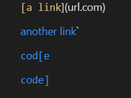
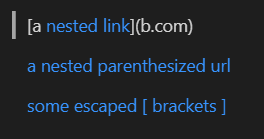
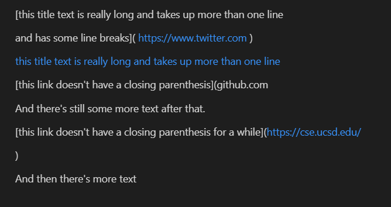
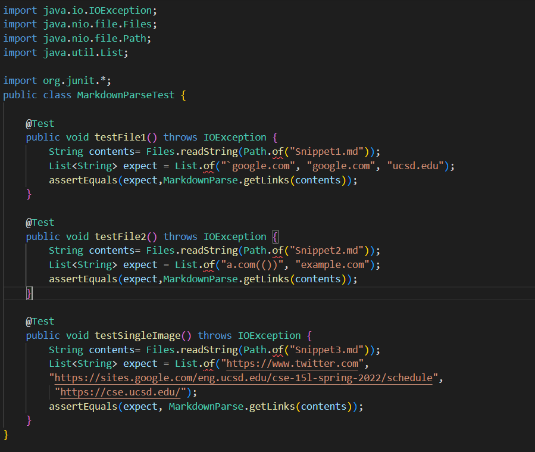
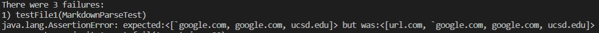
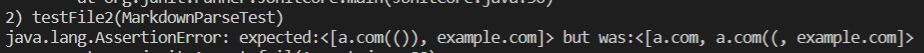
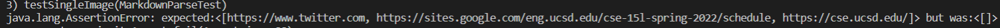
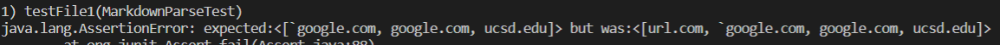
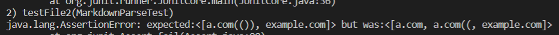
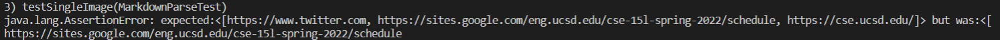

# lab report 4 Week 8
 **in this report I will include two different MarkdownParser, one is mine and another is the one I viewed in the Week 7**

 Here are two links:

 [MarkdownParser from me](https://github.com/Robintianqili/markdown-parser)

[MarkdownParser from another group](https://github.com/YoavGutmanUCSD/markdown-parser-2)

**For each Snippet, by using VS Code Preview mode, we determined what the expectation should be.**

For Snippet One:

It should have `google.com, google.com, ucsd.edu 

For Snippet Two:

It should have a.com(()), example.com

For Snippet Three:

It should have  https://www.twitter.com, https://sites.google.com/eng.ucsd.edu/cse-15l-spring-2022/schedule, https://cse.ucsd.edu/

## To implement the tests, we add three tests in MarkdownParseTest.java

**Here is the image of tests**

**Here are the my implementation results of tests**

**Here are the another group's implementation results**

# Code description for each failure

Q1: 

For Snippet 1, my result includes url.com. The reason is that my Code cannot check **"``"**. Thus, I think I could add a small change to achieve this. First of all, find all inline Code  bounded by backticks. then use replace method to delete all the inline Code. After that we run the process to check website.

Q2:

For Snippet 2, a.com(()) does not come out. The reason here is that my Code just find the closest closeParen. I think I need a more involved change. I think I will use stack to find the correct close paren. For example, starting from "(" and use an integer set as 0, if the program meets another "(", add one to the integer. if the program meets another ")", minus one to the integer. When this integer<0, it means we find the matched CloseParen.

Q3:

For Snippet 3, my code did not output anything. It means that The Code cannot figure out the new lines in brackets and Parentheses. I believe there is a easy way to implement this. At the beginning of the process, we can add new lines like replace("/n", "/r"), delete all the line breaks. Then we perform the process as usual. 